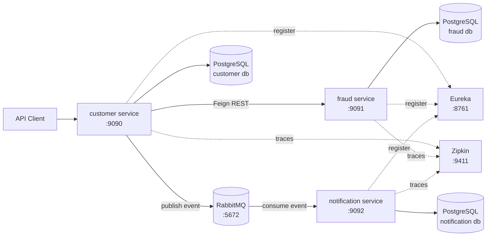

# Archi Microservice App

A Spring Boot microservices portfolio project that demonstrates a realistic customer onboarding flow with service discovery, synchronous service-to-service communication, asynchronous messaging, database migrations, and distributed tracing.

## Why This Project

This project models a common production architecture in a compact form: a customer registration service calls a fraud service through Feign, publishes an event to RabbitMQ, and a notification service consumes that event and persists the notification. Eureka provides service discovery, PostgreSQL stores each service's data, Flyway owns schema migrations, and Zipkin receives distributed traces across the request flow.

## Architecture



## Modules

| Module | Purpose | Default port |
| --- | --- | --- |
| `eureka-server` | Service registry for local discovery. | `8761` |
| `customer` | Customer registration API. Saves customers, calls fraud service, publishes notification events. | `9090` |
| `fraud` | Fraud check API. Stores fraud check history. | `9091` |
| `notification` | Notification API and RabbitMQ consumer. Persists sent notifications. | `9092` |
| `clients` | Shared Feign clients and request/response records. | N/A |
| `amqp` | Shared RabbitMQ publishing/configuration helpers. | N/A |

## Infrastructure

Supporting infrastructure is defined in `docker-compose.yml`.

| Service | URL / port |
| --- | --- |
| PostgreSQL | `localhost:5432` |
| pgAdmin | `http://localhost:5050` |
| RabbitMQ | `localhost:5672`, management UI `http://localhost:15672` |
| Zipkin | `http://localhost:9411` |

## Main Flow

1. `POST /api/v1/customers` receives a customer registration request.
2. `customer` saves the customer in PostgreSQL.
3. `customer` calls `fraud` through the shared Feign client.
4. `fraud` records a fraud check and returns `isFraudster`.
5. If the customer is not fraudulent, `customer` publishes a notification message to RabbitMQ.
6. `notification` consumes the RabbitMQ message and stores it in PostgreSQL.
7. Sleuth sends spans from each service to Zipkin so the flow can be inspected as a distributed trace.

## Prerequisites

- Java 17
- Maven
- Docker and Docker Compose

## Configuration

Copy the sample environment file before starting infrastructure or services:

```bash
cp .env.example .env
```

The committed `.env.example` documents required environment variables for PostgreSQL, pgAdmin, and RabbitMQ. The real `.env` file is ignored by Git.

## Running The Services

Start PostgreSQL, pgAdmin, RabbitMQ, and Zipkin:

```bash
docker compose up -d
```

Build the full Maven reactor:

```bash
mvn clean install
```

Start the applications in separate terminals:

```bash
mvn -pl eureka-server spring-boot:run
mvn -pl fraud spring-boot:run
mvn -pl notification spring-boot:run
mvn -pl customer spring-boot:run
```

Stop infrastructure:

```bash
docker compose down
```

For a clean database demo, remove volumes too:

```bash
docker compose down -v
```

## API Examples

Register a customer:

```bash
curl -X POST http://localhost:9090/api/v1/customers \
  -H "Content-Type: application/json" \
  -d '{
    "firstName": "Ada",
    "lastName": "Lovelace",
    "email": "ada@example.com"
  }'
```

Check fraud status directly:

```bash
curl http://localhost:9091/api/v1/fraud-check/1
```

Send a notification directly:

```bash
curl -X POST http://localhost:9092/api/v1/notification \
  -H "Content-Type: application/json" \
  -d '{
    "toCustomerId": 1,
    "toCustomerEmail": "ada@example.com",
    "message": "Welcome"
  }'
```

## Tracing

Zipkin is available at `http://localhost:9411`. The services use Spring Cloud Sleuth with a demo sampling probability of `1.0`, so local customer registration requests are sent to Zipkin by default.

After running the customer registration curl, open Zipkin and search for traces for the `customer`, `fraud`, or `notification` services.

## Tests

Run the default unit test suite:

```bash
mvn test
```

Run the optional Testcontainers PostgreSQL integration test:

```bash
RUN_TESTCONTAINERS=true mvn -pl fraud test
```

## Database Migrations

Each persistence service owns its schema through Flyway migrations:

| Service | Migration |
| --- | --- |
| `customer` | `customer/src/main/resources/db/migration/V1__create_customer.sql` |
| `fraud` | `fraud/src/main/resources/db/migration/V1__create_fraud_check_history.sql` |
| `notification` | `notification/src/main/resources/db/migration/V1__create_notification.sql` |

Hibernate is configured with `ddl-auto: validate`, so the application validates the schema rather than silently changing it at runtime.

## License

MIT
